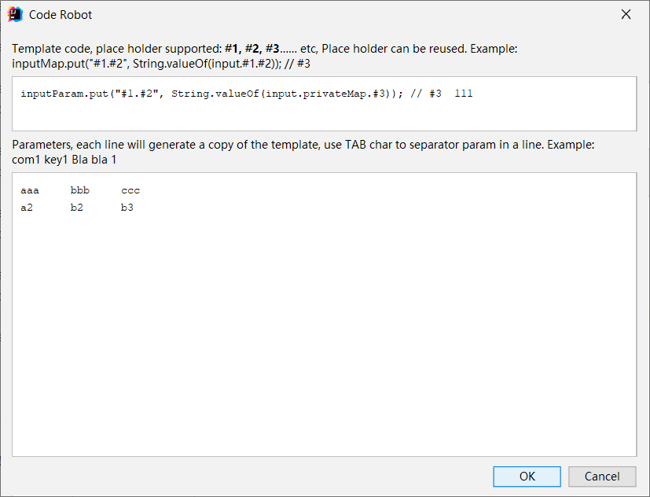

# CodeRobot
An IDEA plugin, generate code by template and parameter automatically

## install
Download the [CodeRobot.jar](CodeRobot.jar), drag & drop the download file into IDEA main window, then DONE!

## Usage
After install， just press Ctrl+Alt+G or open it from IDEA Tools menu/Code robot menu item.

## Screenshot

